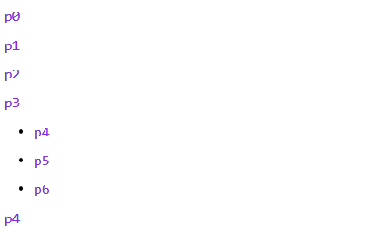
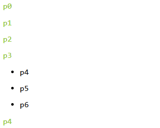
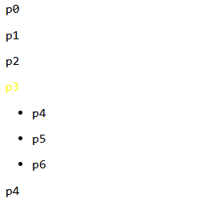
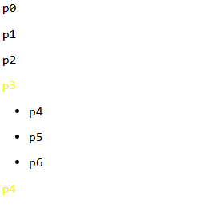
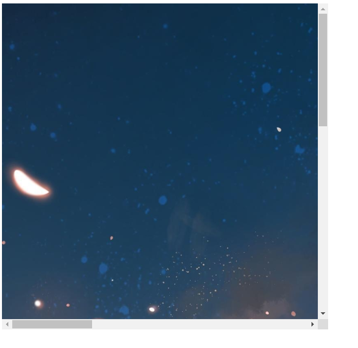
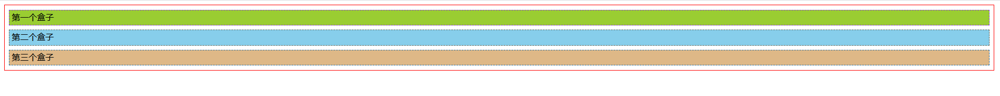
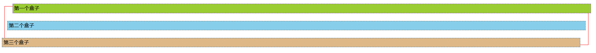
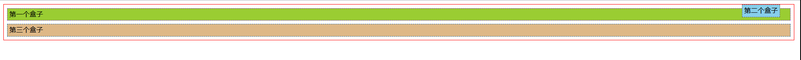
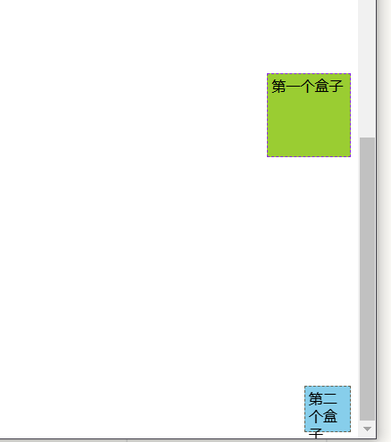

# CSS

## 选择器

如果只是标签选择器，优先级满足就近原则：行内样式     >   内部样式  >   外部样式

```html
<!DOCTYPE html>
<html lang="en">
<head>
    <meta charset="UTF-8">
    <title>Title</title>
    <style>
        /* 选择器三种：
        标签选择器
        类选择器 . +属性名字,可跨标签
        ID选择器 #+id名字 ,且id全局唯一
        优先级：id > class > 标签*/
        h1{
            color: red;
        }
        .hhhh{
            color: blue;
        }
        #jiji{
            color: yellowgreen;
        }
        p{
            color: blueviolet;
        }
    </style>
</head>
<body>
<h1>Java</h1>
<h1 class="hhhh">Java2</h1>
<h1 class="hhhh">Java3</h1>
<h1 id="jiji" class="hhhh">Java4</h1>
<p class="hhhh" >python</p>
</body>
</html>
```

### 层次选择器

**后代选择器**：选择所有的后代,body后面的所有p标签,element element

```css
body p{
        color: blueviolet;
    }
```



**子代选择器**：选择父元素为body元素的所有p标签，element>element

```css
body>p{
       color: yellowgreen;
      }
```



因为这里的p4、p5、p6在列表里面所以不会被选中。

**相邻选择器**：只选择一个 选择（向下）

```css
.lll + p{
   color: yellow;
}
```



**通用选择器**：同样向下选中但是个数不是一个

```css
.lll~p{
    color: yellow;
}
```



完整网页代码：

```html
<!DOCTYPE html>
<html lang="en">
<head>
    <meta charset="UTF-8">
    <title>层次选择器</title>

    <style>
    body p{
    /*后代选择器*/
        color: blueviolet;
    }
 /*   !* 子选择器   *!*/
    body>p{
            color: yellowgreen;
        }
    /* 相邻选择器：只选择一个 选择（向下）*/
    .lll + p{
        color: yellow;
    }
   /* 通用选择器: 同样向下   个数不是一个   */
    .lll~p{
        color: yellow;
    }
    </style>
</head>
<body>
    <p>p0</p>
    <p>p1</p>
    <p class="lll">p2</p>
    <p>p3</p>
    <ul>
        <li>
            <p>p4</p>
        </li>
        <li>
            <p>p5</p>
        </li>
        <li>
            <p>p6</p>
        </li>
    </ul>
    <p>p4</p>
</body>
</html>
```


### 属性选择器

```html
<!DOCTYPE html>
<html lang="en">
<head>
    <meta charset="UTF-8">
    <title>Title</title>
    <style>
        .demo a{
            float: left;
            display: block;
            height: 50px;
            width: 50px;
            border-radius: 10px;
            background-color: blueviolet;
            text-align: center;
            color: yellowgreen;
            text-decoration: none;
            margin-right: 5px;
            font: bold 20px/50px Arial;
        }
    /* 存在id属性的元素   */
    /* 属性名；属性名+属性值   */
/*        a[id]{
            background-color: yellow;
        }*/
/*
        a[id=first]{
            background-color: yellow;
        }
*/
    /*
    注意class需要双引号，而id不用，因为id唯一
    =：绝对等于
    *= :包含这个元素
    */
/*    a[class="links"]{
        background-color: yellow;
    }此时=不起作用*/
/*    a[class*="first"]{
        background-color: yellow;
    }*/
    /*选中href中以http开头的元素
    ^=表示以什么开头*/
/*    a[href^=http]{
        background-color: yellow;
    }*/
    /*$=：结尾*/
    a[href$=pdf] {
        background-color: yellow;
    }
    </style>
</head>
<body>
<p class="demo">
    <a href="http://www.baidu.com" class="links item first" id="first">1</a>
    <a href="" class="links item active" target="_blank">2</a>
    <a href="images/123.html" class="links item">3</a>
    <a href="images/123.png" class="links item">4</a>
    <a href="images/123.jpg" class="links item">5</a>
    <a href="abc" class="links item">6</a>
    <a href="/a.pdf" class="links item">7</a>
    <a href="/abc.pdf" class="links item">8</a>
    <a href="abc.doc" class="links item">9</a>
    <a href="abcd.doc" class="links item last" id="last">10</a>
</p>

</body>
</html>
```

更多的情况:

| [[*attribute*\]](https://www.w3school.com.cn/cssref/selector_attribute.asp) | [target]        | 选择带有 target 属性所有元素。                |
| ------------------------------------------------------------ | --------------- | --------------------------------------------- |
| [[*attribute*=*value*\]](https://www.w3school.com.cn/cssref/selector_attribute_value.asp) | [target=_blank] | 选择 target="_blank" 的所有元素。             |
| [[*attribute*~=*value*\]](https://www.w3school.com.cn/cssref/selector_attribute_value_contain.asp) | [title~=flower] | 选择 title 属性包含单词 "flower" 的所有元素。 |
| [[*attribute*\|=*value*\]](https://www.w3school.com.cn/cssref/selector_attribute_value_start.asp) | [lang\|=en]     | 选择 lang 属性值以 "en" 开头的所有元素。      |

### 结构伪类选择器

```html
<!DOCTYPE html>
<html lang="en">
<head>
    <meta charset="UTF-8">
    <title>结构伪类选择器</title>
    <style>
        /*选中ul的第一个子元素*/
        ul li:first-child{
            background-color: yellowgreen;
        }
        /*选中ul的最后一个子元素*/
        ul li:last-child{
            background-color: blueviolet;
        }
        /*选择p标签的父类的第一个子元素，且当此元素为p时才生效 按顺序选择*/
        p:nth-child(1){
            background-color: red;
        }
        /*选中当前父类下的第一个p元素 按类型*/
        p:nth-of-type(2){
            background-color: chocolate;
        }
/*        p[class*="55"]{
  类选择器          background-color: red;
        }*/
    </style>
</head>
<body>
<h>标题</h>
<p class="123 456 789">p1</p>
<p class="123 55">p2</p>
<p class="55 789">p3</p>
<p>p4</p>
<ul>
    <li>p5</li>
    <li>p6</li>
    <li>p7</li>
    <li>p8</li>
</ul>
</body>
</html>
```


## 美化网页

### 列表

```html
<!DOCTYPE html>
<html lang="en">
<head>
    <meta charset="UTF-8">
    <title>列表</title>
    <style>
        .title{
            font-size: 50px;
            font-weight: bold;
            text-indent: 2em;
            height: 50px;
            line-height: 50px;
            background-color: skyblue;
        }
        ul{
            background-color: yellowgreen;
        }
        ul li{
            line-height: 30px;
            list-style: none;/*去掉原点*/
            list-style: circle;/*空心圆*/
            list-style: decimal;/*数字*/
            text-indent: 2em;
        }
    </style>
</head>
<body>
<h2 class="title">开发语言</h2>
<ul>
    <li>java</li>
    <li>Python</li>
    <li>C</li>
    <li>C++</li>
    <li>C#</li>
    <li>Go</li>
</ul>
</body>
</html>
```


### 字体

```html
<!DOCTYPE html>
<html lang="en">
<head>
    <meta charset="UTF-8">
    <title>字体样式</title>
    <style>
        /*字体相关*/
        body{
            font-family: Consolas;
            font-size: 50px;
            font-weight: bold;
            color: skyblue;
            /*等价于font: oblique bolder 50px Consolas;
            第一个是字体的样式 斜体之类的*/

        }
        .p1{
            font-family: "JetBrains Mono";
        }
    </style>
</head>
<body>
<!--把一些重点的字放在span里面-->
<span></span>
<p>
    刚才一个网友告诉我给外卖骑手好评骑手收入就会加一块钱，
    我以前都不知道还总是懒得评论…难怪每次骑手都要说麻烦给个
    五星好评，以后都要记得给好评啊！ ​​​​
</p>
<p class="p1">
    class sdaada
</p>
</body>
</html>
```


### 文本

```html
<!DOCTYPE html>
<html lang="en">
<head>
    <meta charset="UTF-8">
    <title>文本样式</title>
    <!--颜色 对齐方式 缩进 行高 装饰-->
    <style>
        h1{
            color: rgba(0,255,255,0.5);/*最后一个是透明度*/
            text-align: center;/*排版*/
        }
        .p1 {
            text-indent: 2em; /*首行缩进*/
            background-color: pink;
            height: 300px;
            line-height: 300px; /*height和line-height一致时字体居中*/
            text-decoration: underline; /*下划线*/
        }
        img,span{
            vertical-align: middle;/*让文字和图片水平对齐*/
        }
        a{
            text-decoration: none;
        }
    </style>
</head>
<body>
<h1>
    介绍
</h1>
<p class="p1">
    8月13日，Rain在个人社交网站上传了一组新照，照片中他穿着牛仔服，
    烫着卷发，然而脸颊瘦到凹陷，明
    显比之前憔悴不少，似乎是因为减肥过度以
    及近期打歌舞台频繁所致。据悉，Rain此前曾在三个月内减重20斤，暴瘦
    后的他让不少粉丝大呼心疼
</p>
<p class="test">
    
    <span>sadjhaihdiada</span>
    <a href="#">超链接去下划线</a>
</p>
</body>
</html>
```

****

关于超链接下划线去除的方法：**`text-decoration: none;`**。

### 背景图片

```html
<!DOCTYPE html>
<html lang="en">
<head>
    <meta charset="UTF-8">
    <title>Title</title>
    <style>
        div{
            width: 1000px;
            height: 800px;
            border: 1px;
            background-image: url("../../../resource/image/2.jpg");
        /* 默认全部平铺 repeat   */
        }
        .div1{
            background-repeat: no-repeat;
            background-position: 20px 50px;/*定位*/
        }
        .div2{
            background-repeat: repeat-x;
        }
        .div3{
            background-repeat: repeat-y;
        }

    </style>
</head>
<body>
<div class="div1"></div>
<div class="div2"></div>
<div class="div3"></div>
</body>
</html>
```


### 渐变

```html
<!DOCTYPE html>
<html lang="en">
<head>
    <meta charset="UTF-8">
    <title>渐变</title>
    <style>
        body{
            background-color: #4158D0;
            background-image: -webkit-linear-gradient(135deg, #4158D0 0%, #C850C0 46%, #FFCC70 100%);
            background-image: -moz-linear-gradient(135deg, #4158D0 0%, #C850C0 46%, #FFCC70 100%);
            background-image: -o-linear-gradient(135deg, #4158D0 0%, #C850C0 46%, #FFCC70 100%);
            background-image: linear-gradient(135deg, #4158D0 0%, #C850C0 46%, #FFCC70 100%);
        }
        a{
            text-decoration: none;
        }
    </style>
</head>
<body>
<p>
    <a href="https://www.grabient.com/">渐变的网站</a>
</p>
</body>
</html>
```


### 超链接伪类

```html
<!DOCTYPE html>
<html lang="en">
<head>
    <meta charset="UTF-8">
    <title>超链接伪类</title>
    <style>
        a{
            text-decoration: none;
            color: #000000;
        }
        /*鼠标悬浮的效果*/
        a:hover{
            color: pink;
            font-size: 50px;
        }
        /*鼠标点击未释放*/
        a:active{
            color: yellowgreen;
        }
        /*阴影：阴影颜色 x轴 y轴 阴影半径*/
        #price{
            text-shadow: skyblue 10px 0px 3px;
        }
    </style>
</head>
<body>
<a href="#">
    
</a>
<p>
    <a href="#">吾王剑锋所指，吾等心之所向</a>
</p>
<p id="price">
    ￥99
</p>
</body>
</html>
```


## 盒子模型

### margin

**居中的方法   margin: 0 auto**

```html
<!DOCTYPE html>
<html lang="en">
<head>
    <meta charset="UTF-8">
    <title>Title</title>
    <style>
        /*margin：外边距
        border：边框
        padding：内边距*/
        /*border:粗细，样式，颜色*/
        /*body默认外边距8*/
        body{
            margin: 0;
        }
        #box{
            width: 300px;
            border: 3px solid red;
            margin: 0 auto;
        /* 居中   margin: 0 auto */
        }
        /*h2也有默认的外边距*/
        /*margin：一个参数就是所有方向
        两个参数前者为上下，后者为左右
        四个参数为顺时针旋转，即上右下左*/
        h2{
            font-size: 16px;
            background-color: blueviolet;
            line-height: 30px;
            margin: 0;
        }
        form{
            background-color: yellowgreen;
        }
        input{
            border: 1px solid black;
        }
    </style>
</head>
<body>
<div id="box">
    <h2>会员登陆</h2>
    <form action="#">
        <div>
            <span>用户名:</span>
            <input type="text">
        </div>
        <div>
            <span>密码:</span>
            <input type="text">
        </div>
        <div>
            <span>邮箱:</span>
            <input type="text">
        </div>
    </form>
</div>
<!--盒子模型的计算方法：margin+border+padding+内容宽度-->
</body>
</html>
```


### border

实线：solid，虚线：dashed

```html
<!DOCTYPE html>
<html lang="en">
<head>
    <meta charset="UTF-8">
    <title>Title</title>
    <style>
        /*margin：外边距
        border：边框
        padding：内边距*/
        /*border:粗细，样式，颜色*/
        /*body默认外边距8*/
        body{
            margin: 0;
        }
        #box{
            width: 300px;
            border: 3px solid red;
        }
        /*h2也有默认的外边距*/
        h2{
            font-size: 16px;
            background-color: blueviolet;
            line-height: 30px;
            margin: 0;
        }
        form{
            background-color: yellowgreen;
        }
        /*div:nth-of-type(1) 包含了body下面的div(大div)，div:nth-of-type(1) input 就包含了所有的input。
        div:nth-of-type(1)>input 加上 > 之后由于所有 input 都不符合“是大 div 的子元素”这一条件，
        再看小div，只有第一个 input 满足“是小 div 的子元素”这一条件，所以加了 > 之后就没问题了。
        至于为什么div:nth-of-type(1) 的时候大 div 没有变色，是因为有 id 选择器，它的作用是在标签选择器之后*/
        div:nth-of-type(1)>input{
            border: 3px solid red;
        }
        div:nth-of-type(2)>input{
            border: 3px dashed blue;
        }
/*        div:nth-of-type(3)>span{
            font-size: 30px;
        }*/
        div:nth-of-type(3)>input{
            border: 3px solid brown;
        }
        div>span{
            font-size: 30px;
        }
    </style>
</head>
<body>
<div id="box">
    <h2>会员登陆</h2>
    <form action="#">
        <div>
            <span>用户名:</span>
            <input type="text">
        </div>
        <div>
            <span>密码:</span>
            <input type="text">
        </div>
        <div>
            <span>邮箱:</span>
            <input type="text">
        </div>
    </form>
</div>
</body>
</html>
```

#### radius

```html
<!DOCTYPE html>
<html lang="en">
<head>
    <meta charset="UTF-8">
    <title>圆角边框</title>
<!--radius：左上 右上 右下 左下    -->
<!--圆形：圆角等于半径-->
    <style>
        div{
            width: 100px;
            height: 100px;
            border: 10px solid red;
            border-radius: 50px 20px;
        }
    </style>
</head>
<body>
<div></div>
</body>
</html>
```

```html
<!DOCTYPE html>
<html lang="en">
<head>
    <meta charset="UTF-8">
    <title>用radius画图</title>
    <style>
/*     div{
         width: 100px;
         height: 100px;
         border: 10px solid red;
         border-radius: 0 50px 0 0;
     }*/
    /*扇形    */
        div{
            width: 50px;
            height: 50px;
            margin: 30px;
            background-color: red;
            border-radius: 50px 0 0 0;
        }
        img{
            border-radius: 320px;
        /*    让照片变圆形：圆角为规格的一半*/
        }
    </style>
</head>
<body>
<div></div>

</body>
</html>
```


### padding

内边距，不允许使用负值

### 阴影

盒子阴影：` box-shadow: 10px 10px 1px black;`

```html
<!DOCTYPE html>
<html lang="en">
<head>
    <meta charset="UTF-8">
    <title>阴影</title>
    <style>
        div{
            width: 100px;
            height: 100px;
            border: 10px solid red;
            box-shadow: 10px 10px 1px black;
        }
    </style>
</head>
<body>
<div>

</div>
</body>
</html>
```


## 浮动

####  display

```html
<!DOCTYPE html>
<html lang="en">
<head>
    <meta charset="UTF-8">
    <title>display</title>
    <style>
        /*display：block-----使之成为块级元素
                   inline--------变为行内元素
                    inline-block------是块级元素但是可以内联。。在一行
                    none---消失*/
        /*float:让元素浮动起来  一般使用这个来进行元素排版
        float会让元素超出标准文档流，会造成父级边框塌陷的问题*/
        div{
            width: 100px;
            height: 100px;
            border: 3px solid red;
            float: left;
        }
        span{
            width: 100px;
            height: 100px;
            border: 3px dashed red;
            display: inline-block;
            float: right;
        }
    </style>
</head>
<body>
<!--块级元素：h1~h6 p div 列表…-->
<!--行内元素：span a img strong…-->
<div>div块级元素</div>
<span>span行内元素</span>
</body>
</html>
```


#### float

该属性定义元素在哪个方向浮动。

```html
<!DOCTYPE html>
<html lang="en">
<head>
    <meta charset="UTF-8">
    <title>float</title>
    <link rel="stylesheet" href="style.css" type="text/css"/>
<!--    解决父级边框塌陷问题：
1.增加父级元素的高度
2.增加一个空的div，清除浮动
3.在父级元素中使用overflow:hidden 隐藏超出的内容
4.在父级元素后面增加一个伪类 after-->
</head>
<body>
<div id="father">
    <div class="layer01"></div>
    <div class="layer02"></div>
    <div class="layer03">
        浮动的盒子既可以左浮动也可以忘忧浮动，浮动会脱离标准文档流
    </div>
</div>
<div class="clear"></div>
</body>
</html>
```

```css
div{
    margin: 10px;
    padding: 5px;
}
#father{
    border: 1px #000 solid;
    height: 300px;
/*    height: 800px;*//*方法一*/
/*    overflow: hidden;*//*方法三*/
}
#father:after{/*方法4，推荐*/
    content: '';
    display: block;
    clear: both;
}
/*clear:right;右侧不允许有浮动元素
clear:Left; 左侧不允许有浮动元素
clear:both; 两侧不允许有浮动元素*/
.layer01{
    border: 1px #F00 dashed;
    display: inline-block;
    float: left;
}
.layer02{
    border: 1px #00F dashed;
    display: inline-block;
    float: right;
}
.layer03{
    border: 1px #666 dashed;
    font-size: 12px;
    line-height: 23px;
    display: inline-block;
    float: right;
}
/*.clear{
    clear: both;
    margin: 0;
    padding: 0;
}*/
/*方法三*/
```


#### overflow

该属性规定了当内容溢出元素框时发生的事情。

可能的值：

| 值      | 描述                                                     |
| :------ | :------------------------------------------------------- |
| visible | 默认值。内容不会被修剪，会呈现在元素框之外。             |
| hidden  | 内容会被修剪，并且其余内容是不可见的。                   |
| scroll  | 内容会被修剪，但是浏览器会显示滚动条以便查看其余的内容。 |
| auto    | 如果内容被修剪，则浏览器会显示滚动条以便查看其余的内容。 |
| inherit | 规定应该从父元素继承 overflow 属性的值。                 |

```html
<!DOCTYPE html>
<html lang="en">
<head>
    <meta charset="UTF-8">
    <title>测试overflow</title>
    <style>
        /*overflow 会在页面缩小时产生滚动条*/
        #content{
            height: 800px;
            width: 800px;
            overflow: scroll;
        }
    </style>
</head>
<body>
<div id="content">
    
    <p>
        虚线 外文名 Dotted line 读 音 xūxiàn 简 介 以点或者短线画成的断续的线 应 用
        用路径画出形状 目录 1 涵义 2 虚线的应用 虚线 涵义 编辑 以点
        或者短线画成的断续的线
    </p>
</div>
</body>
</html>
```




## 定位position

默认网页情况：

```html
<!DOCTYPE html>
<html lang="en">
<head>
    <meta charset="UTF-8">
    <title>Title</title>
    <style>
        div{
            margin: 10px;
            padding: 5px;
            font-size: 12px;
            line-height: 25px;
        }
        #father{
            border: 1px solid red;
            padding: 0;
        }
        #first{
            background-color: yellowgreen;
            border: 1px dashed blueviolet;
        }
        #second{
            background-color: skyblue;
            border: 1px dashed #666555;
        }
        #third{
            background-color: burlywood;
            border: 1px dashed #256da1;
        }
    </style>
</head>
<body>
<div id="father">
    <div id="first">第一个盒子</div>
    <div id="second">第二个盒子</div>
    <div id="third">第三个盒子</div>
</div>
</body>
</html>
```



#### 相对定位

```html
<!DOCTYPE html>
<html lang="en">
<head>
    <meta charset="UTF-8">
    <title>相对定位</title>
    <style>
        body{
            padding: 20px;
        }
        div{
            margin: 10px;
            padding: 5px;
            font-size: 12px;
            line-height: 25px;
        }
        #father{
            border: 1px solid red;
            padding: 0;
        }
        #first{
            background-color: yellowgreen;
            border: 1px dashed blueviolet;
            position: relative;/*相对定位：上下左右*/
            top: -20px;/*这里为靠近上边*/
            left: 20px;/*向右移动,距离左边20px也就是向右移动*/
        }
        #second{
            background-color: skyblue;
            border: 1px dashed #666555;
        }
        #third{
            background-color: burlywood;
            border: 1px dashed #256da1;
            position: relative;
            bottom: -20px;
            right: 20px;/*可以理解为距离原来的位置多远*/
        }/*相对定位后仍然处于标准文档流中，原来位置依然保留*/
    </style>
</head>
<body>
<div id="father">
    <div id="first">第一个盒子</div>
    <div id="second">第二个盒子</div>
    <div id="third">第三个盒子</div>
</div>
</body>
</html>
```



#### 绝对定位

```html
<!DOCTYPE html>
<html lang="en">
<head>
    <meta charset="UTF-8">
    <title>绝对定位</title>
    <style>
        div{
            margin: 10px;
            padding: 5px;
            font-size: 12px;
            line-height: 25px;
        }
        #father{
            border: 1px solid red;
            padding: 0;
            position: relative;/*如果父级元素有定位就基于父级元素偏离*/
        }
        #first{
            background-color: yellowgreen;
            border: 1px dashed blueviolet;
        }
        #second{
            background-color: skyblue;
            border: 1px dashed #666555;
            position: absolute;/*父级元素没有定位的时候是基于浏览器定位*/
            right: 30px;/*距离浏览器页面右边30px*/
            top: -10px;/*因为父级有定位，所以是不可能超出父级元素的*/
            /*绝对定位不会保留原来的位置*/
        }
        #third{
            background-color: burlywood;
            border: 1px dashed #256da1;
        }
    </style>
</head>
<body>
<div id="father">
    <div id="first">第一个盒子</div>
    <div id="second">第二个盒子</div>
    <div id="third">第三个盒子</div>
</div>
</body>
</html>
```



#### 固定定位

生成绝对定位的元素，相对于浏览器窗口进行定位。

元素的位置通过 "left", "top", "right" 以及 "bottom" 属性进行规定。

```html
<!DOCTYPE html>
<html lang="en">
<head>
    <meta charset="UTF-8">
    <title>固定定位</title>
    <style>
        body{
            height: 1000px;
        }
        div{
            margin: 10px;
            padding: 5px;
            font-size: 12px;
            line-height: 25px;
        }
        #father{
            border: 1px solid red;
            padding: 0;
        }
        #first{
            width: 100px;
            height: 100px;
            background-color: yellowgreen;
            border: 1px dashed blueviolet;
            position: absolute;
            right: 0;
            bottom: 0;
        }
        div:nth-of-type(2){
            width: 50px;
            height: 50px;
            background-color: skyblue;
            border: 1px dashed #666555;
            position: fixed;/*固定定位*/
            right: 0;
            bottom: 0;
        }
        #third{
            background-color: burlywood;
            border: 1px dashed #256da1;
        }
    </style>
</head>
<body>
<div id="father">
    <div id="first">第一个盒子</div>
    <div id="second">第二个盒子</div>
    <div id="third">第三个盒子</div>
</div>
</body>
</html>
```



#### z-index

类似于图层叠加

```html
<!DOCTYPE html>
<html lang="en">
<head>
    <meta charset="UTF-8">
    <title>z-index</title>
    <link rel="stylesheet" href="style.css">
</head>
<body>
<div id="content">
    <ul>
        <li></li>
        <li class="tipTest">一大大大大大大大段文字</li>
        <li class="tipBg"></li>
        <li>时间：2020-8-12</li>
        <li>地点：火星基地</li>
    </ul>
</div>
</body>
</html>
```

```css
#content{
    margin: 0px;
    padding: 0px;
    overflow: hidden;
    font-size: 12px;
    line-height: 25px;
    border: 1px solid #000000;
}
ul,li{
    padding: 0px;
    margin: 0px;
    list-style: none;
}
#content ul{
    position: relative;
}
.tipTest,.tipBg{
    position: absolute;
    width: 960px;
    height: 25px;
    top: 954px;
}
.tipTest{
    color: white;
    z-index: 999;
}
.tipBg{
    background-color: red;
    opacity: 0.5;/*透明度*/
}
```


