# 注解和反射

## 注解

### 1. 注解是什么

Annotation，注解又称标注，是Java5引入的一种注释机制。可以把注解理解为一种在代码里的特殊标记。或者直接理解为标签机制，就像往事物上贴标签一样，使用注解就像对代码进行贴标签。那我们一般使用标签的目的是什么？一般而言是对事物进行解释和说明。

官方解释：注解是一系列元数据，它==提供数据用来解释程序代码==，但是**注解并非是所解释的代码本身的一部分**。注解对于代码的运行效果没有直接影响。

### 2. 内置注解

1. `@Override`

提示子类要复写了父类中的方法，注意这个注解是写在子类方法上面的，不是说复写父类中被 @Override 修饰的方法，父类中不会有被`@Override`修饰的方法。

下面是来自Object类中的toString方法的截图。

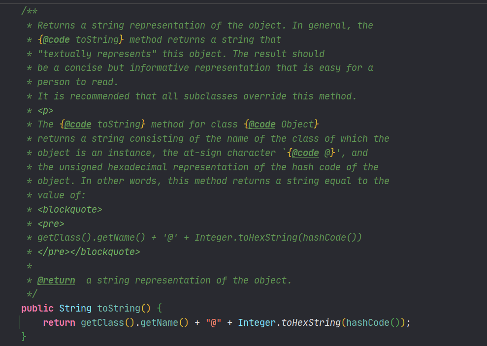

2. `@Deprecated`

用于表示已经废弃的，不建议使用

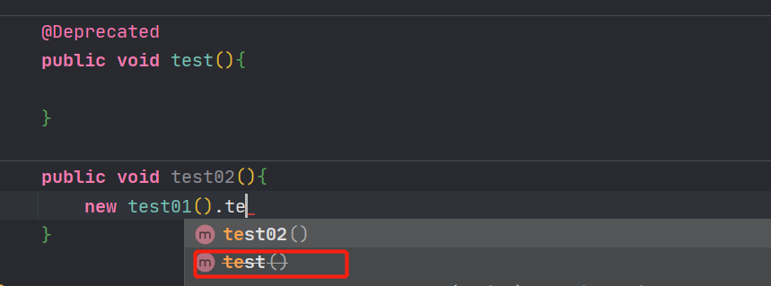

3. `@SuppressWarnings("all")`

用于镇压警告，注意里面有个all字符串这里涉及到下面的内容，在这里只需要记住这个注解会镇压所有的警告.

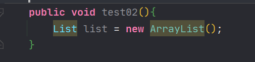

使用之后：

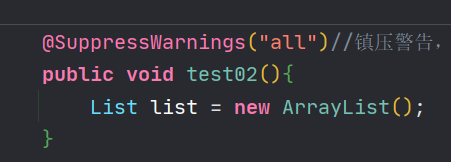

### 3. 元注解

元注解是可以注解到注解上的注解，或者说元注解是一种基本注解，但是它能够应用到其它的注解上面。可以理解为用于解释其他标签的标签。

1. `@Target`

和其英语含义一样，是目标的意思，用于描述注解的使用范围（即：被描述的注解可以用在什么地方）

属性值：使用的是枚举类ElementType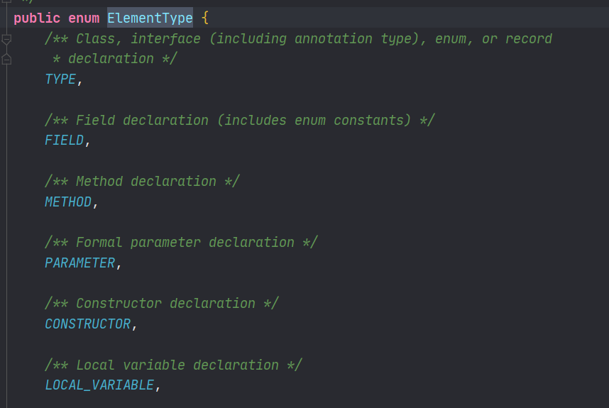

2. `@Retention`

表示需要在什么级别保存该注释信息，用于描述注解的生命周期，(SOURCE < CLASS < RRUNTIME)====源代码、类、运行时

属性值：枚举类RetentionPolicy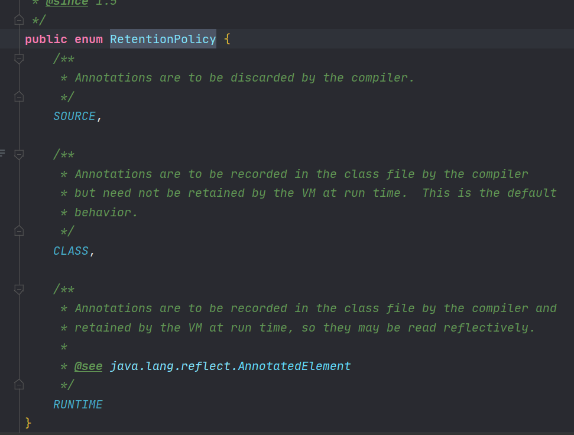

3. `@Document`

说明该注解将被包含在javadoc中

4. `@Inherited`

表示子类可以继承该父类中的该注解

```java
@Inherited
@interface Test {}
@Test
public class A {}
public class B extends A {}
```

注解 Test 被 @Inherited 修饰，之后类 A 被 Test 注解，类 B 继承 A,类 B 也拥有 Test 这个注解。

### 4.注解的属性

注解的属性也叫做成员变量。注解只有成员变量，没有方法。注解的成员变量在注解的定义中以“无形参的方法”形式来声明，其方法名定义了该成员变量的名字，其返回值定义了该成员变量的类型。

```java
@Target(ElementType.TYPE)
@Retention(RetentionPolicy.RUNTIME)
public @interface TestAnnotation {
    int id();
    String msg();
}
```

上面代码定义 TestAnnotation 这个注解中拥有 id 和 msg 两个属性。在使用的时候，我们应该给它们进行赋值。

赋值的方式是在注解的括号内以 value=”” 形式，多个属性之前用 ，隔开。

```java
@TestAnnotation(id=3,msg="hello annotation")
public class Test {
}
```

需要注意的是，在注解中定义属性时它的类型必须是 8 种基本数据类型外加 类、接口、注解及它们的数组。

注解中属性可以有默认值，默认值需要用 default 关键值指定。比如：

```java
@Target(ElementType.TYPE)
@Retention(RetentionPolicy.RUNTIME)
public @interface TestAnnotation {
    public int id() default -1;
    public String msg() default "Hi";
}
```

TestAnnotation 中 id 属性默认值为 -1，msg 属性默认值为 Hi。
它可以这样应用。

```java
@TestAnnotation()
public class Test {}
```

因为有默认值，所以无需要再在 @TestAnnotation 后面的括号里面进行赋值了，这一步可以省略。

另外，还有一种情况。如果一个注解内仅仅只有一个名字为 value 的属性时，应用这个注解时可以直接接属性值填写到括号内。

```java
public @interface Check {
    String value();
}
```

上面代码中，Check 这个注解只有 value 这个属性。所以可以这样应用。

```java
@Check("hi")
int a;
```

这和下面的效果是一样的

```java
@Check(value="hi")
int a;
```

最后，还需要注意的一种情况是一个注解没有任何属性。比如

```java
public @interface Perform {}
```

那么在应用这个注解的时候，括号都可以省略。

```java
@Perform
public void testMethod(){}
```

### 5. 自定义注解

注意上面一直没写道，注解是可以包含值的，这里我将用自定义的注解来进行演示。

声明注解:

```java
public @interface TestAnnotation {
}
```

如果注解有属性

```java
@Target({ElementType.METHOD,ElementType.TYPE})
@Retention(RetentionPolicy.RUNTIME)
@interface MyAnnotation2{
    String value();//value可以不用写参数名
}
```

单独一个属性时可以不用在使用是写出参数名。上面的注解的属性中已经进行了演示。

总结一下：

```java
@interface用来声明一个注解，格式：public @interface注解名 {定义内容}
其中的每一个方法(这里写的方法是因为类似value()这样可能会让很多学过Java的人认为这是一种方法)实际上是声明了一个配置参数.
理解成属性或参数都是ok的
方法的名称就是参数的名称.
返回值类型就是参数的类型（返回值只能是基本类型，Class,String,enum).
可以通过default来声明参数的默认值
如果只有一个参数成员，一般参数名为value
注解元素必须要有值，我们定义注解元素时，经常使用空字符串，0作为默认值.
```

后面的spring、mybatis、springboot等Java框架都大量地使用注解，使用注解无疑简化了很大部分的操作。但是注解又是怎么起作用的呢，那就必须用到Java神奇的反射机制，看到过一句话：框架 = 注解 + 反射机制 + 设计模式。

## 反射

### 1. 什么是反射

Java的反射（reflection）机制是指在**程序的运行状态**中，可以构造任意一个类的对象，可以了解任意一个对象所属的类，可以了解任意一个类的成员变量和方法，可以调用任意一个对象的属性和方法。这种动态获取程序信息以及动态调用对象的功能称为Java语言的反射机制。反射被视为**动态语言**的关键。简而言之，在你代码运行时对你的代码进行分析，用上面的注解类似于标签的例子，反射就像是这个事物的标签被提取出来，提取这个动作就是反射，通过反射可以知道这个事物的一起，当然不仅仅是标签，这里只是举个反射的作用而已。

下面看看使用反射的简单例子：

```java
public class Test01 {
    
    public static void main(String[] args) throws ClassNotFoundException {

        Class c1 = Class.forName("Reflection.User");
        System.out.println(c1);

        Class c2 = Class.forName("Reflection.User");
        Class c4 = Class.forName("Reflection.User");
        Class c3 = Class.forName("Reflection.User");

        //一个类中只有一个Class对象
        //当一个类被加载之后，类的整个结构都会被封装在Class对象中
        System.out.println(c2.hashCode());
        System.out.println(c3.hashCode());
        System.out.println(c4.hashCode());
    }
}

//实体类
class User{
    private String name;
    private int id;
    private int age;

    public User() {
    }

    public User(String name, int id, int age) {
        this.name = name;
        this.id = id;
        this.age = age;
    }

    public String getName() {
        return name;
    }

    public void setName(String name) {
        this.name = name;
    }

    public int getId() {
        return id;
    }

    public void setId(int id) {
        this.id = id;
    }

    public int getAge() {
        return age;
    }

    public void setAge(int age) {
        this.age = age;
    }


    @Override
    public String toString() {
        return "User{" +
                "name='" + name + '\'' +
                ", id=" + id +
                ", age=" + age +
                '}';
    }
}
```

运行结果：

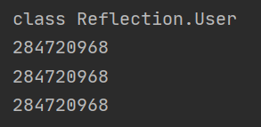


### 2. 获得反射的对象

先构造实体类:

```java
class Person{
    public String name;

    public Person() {
    }

    public Person(String name) {
        this.name = name;
    }

    @Override
    public String toString() {
        return "Person{" +
                "name='" + name + '\'' +
                '}';
    }
}

class Student extends Person{
    public Student() {
        this.name="Student";
    }
}
```

一般有三种方法可以获取Class实例：

1. 通过对象的getClass()方法
2. 通过类的class属性
3. 通过Class类的forName()方法，里面需要的字符串值是类的权限命名
4. 可以通过类加载器，这种方法需要了解类加载器，这里会在JVM中在进行学习

```java
ClassLoader classLoader = Test02.class.getClassLoader();
Class<?> aClass = classLoader.loadClass("Reflection.Student");
```

加载Reflection包下的Student类，我这里的因为Student是在Test02类下的，所以使用的Test02的属性class

其余的基本类型和父类：

```java
    public static void main(String[] args) throws ClassNotFoundException {

        Person student = new Student();
        Class c1 = student.getClass();
        System.out.println(c1.hashCode());

        Class c2 = Student.class;
        System.out.println(c2.hashCode());

        Class c3 = Class.forName("Reflection.Student");
        System.out.println(c3.hashCode());
        
        //所有基本类型的包装类都用TYPE属性
        Class c4 = Integer.TYPE;
        System.out.println(c4);

        Class c5 = c1.getSuperclass();
        System.out.println(c5);
    }
```

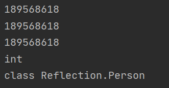

如上结果也可说明一个类只能有一个class对象。

### 3. 所有类型的Class对象


```java
public class Test03 {
    public static void main(String[] args) {

        Class c1 = Object.class;
        Class c2 = String[].class;
        Class c3 = int[][].class;
        Class c4 = void.class;
        Class c5 = Comparable.class;
        Class c6 = Override.class;
        Class c7 = Integer.class;
        Class c8 = ElementType.class;
        Class c9 = Class.class;

        System.out.println(c1);
        System.out.println(c2);
        System.out.println(c3);
        System.out.println(c4);
        System.out.println(c5);
        System.out.println(c6);
        System.out.println(c7);
        System.out.println(c8);
        System.out.println(c9);

    }
}
```

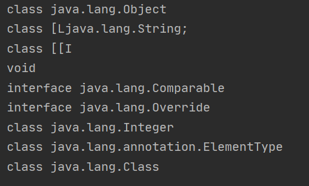

### 4. 类加载内存分析

这里只是粗略的讲一下，更细致的解释还没有写

Java内存一共分为三类：堆、栈、方法区

堆：存放new的对象和数组，可以被所有的线程所共享，不会存放别的对象引用

栈：存放基本变量类型（会包含这个基本类型的数值），引用对象的变量（会存放这个引用在堆里的具体地址）

方法区：可以被所有的线程共享、包含了所有的class和static变量

new出来的对象会去寻找类Class，而Class则是在加载类的时候就已经在堆中创建完成的

关于静态初始化块：

jvm会有一个方法clinit(){}这个方法会将所有的static结合到一起

标准解释：加载-----链接------初始化

**加载**：将class文件字节码内容加载到内存中，并将这些静态数据转换成方法区的运行时数据结构，

然后生成一个代表这个类的java.lang.Class对象.

**链接**：将Java类的二进制代码合并到JVM的运行状态之中的过程。

- 验证：确保加载的类信息符合JVM规范，没有安全方面的问题
- 准备：正式为类变量（static)分配内存并设置类变量默认初始值的阶段，这些内存都将在方法区中进行分配。
- 解析：虚拟机常量池内的符号引用（常量名）替换为直接引用（地址）的过程。

**初始化：**

- 执行类构造器<clinit>()方法的过程。类构造器`<clinit>()`方法是由编译期自动收集类中所有类变量的赋值动作和静态代码块中的语句合并产生的。（类构造器是构造类信息的，不是构造该类对象的构造器）。
- 当初始化一个类的时候，如果发现其父类还没有进行初始化，则需要先触发其父类的初始化。
- 虚拟机会保证一个类的<clinit>()方法在多线程环境中被正确加锁和同步。

### 5. 类初始化

类的主动引用（一定会发生类的初始化）

- 当虚拟机启动，先初始化main方法所在的类
- new一个类的对象
- 调用类的静态成员（除了final常量）和静态方法
- 使用java.lang.reflect包的方法对类进行反射调用
- 当初始化一个类，如果其父类没有被初始化，则先会初始化它的父类

类的被动引用（不会发生类的初始化）

- 当访问一个静态域时，只有真正声明这个域的类才会被初始化。如：当通过子类引用父类的静态变量，不会导致子类初始化
- 通过数组定义类引用，不会触发此类的初始化
- 引用常量不会触发此类的初始化（常量在链接阶段就存入调用类的常量池中了）

```java
public class Test04 {

    public static void main(String[] args) throws ClassNotFoundException {

        System.out.println("Main被加载");

        //主动引用

        //1 new
        //Son son = new Son();

        //2 反射
        //Class.forName("Reflection.Son");

        //被动引用
        //1. 用子类调父类的静态变量 子类不会初始化
        //System.out.println(Son.b);

        //2.对象数组
        //Son[] array = new Son[5];

        //3.常量
        System.out.println(Son.M);
    }

}
class Father{

    static int b = 1;
    static {
        System.out.println("父类被加载");
    }

}
class Son extends Father{
    static {
        System.out.println("子类被加载");
        m = 3;
    }
    static int m = 5;
    static final int M = 9;
}
```

运行结果：

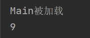

### 6. 类加载器

三种类加载器：系统类加载器、扩展类加载器、根加载器

类加载的作用：

将class文件字节码内容加载到内存中，并将这些静态数据转换成方法区的运行时数据结构，然后在堆中生成一个代表这个类的java.lang.Class对象，作为方法区中类数据的访问入口。

类缓存：标准的JavaSE类加载器可以按要求查找类，但一旦某个类被加载到类加载器中，它将维持加载（缓存）一段时间。不过JVM垃圾回收机制可以回收这些Class对象

```java
public class Test05 {
    public static void main(String[] args) throws ClassNotFoundException {


        //获得系统类的加载器
        ClassLoader systemClassLoader = ClassLoader.getSystemClassLoader();
        System.out.println(systemClassLoader);

        //获得系统类加载器的父类加载器----扩展类加载器
        ClassLoader parent = systemClassLoader.getParent();
        System.out.println(parent);


        //获得扩展类加载器的父类加载器-----根加载器
        System.out.println(parent.getParent());


        //测试当前类
        ClassLoader classLoader = Class.forName("Reflection.Test05").getClassLoader();
        System.out.println(classLoader);

        //jdk中的类
        classLoader = Class.forName("java.lang.Object").getClassLoader();
        System.out.println(classLoader);

        //如何获得系统类加载器可以加载的路径
        System.out.println(System.getProperty("java.class.path"));


    }
}
```

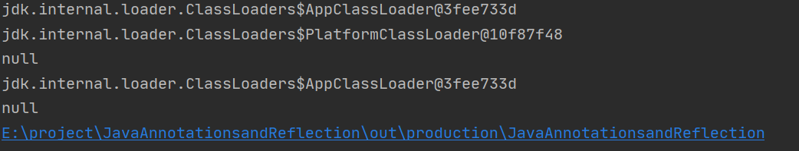

关于双亲委派机制的讲解和破坏，都留到JVM中来讲，这里的关键是使用反射。

### 7.获取类的运行时结构

关于类的一切都可以用反射来获得

```java
public class Test06 {
    public static void main(String[] args) throws ClassNotFoundException, NoSuchFieldException, NoSuchMethodException {
        Class<?> c1 = Class.forName("Reflection.User");

        //通过反射获得类的属性、方法、构造器

        Field[] fields = c1.getFields();//只能获得public属性
        for (Field field : fields) {
            System.out.println(field);
        }

        fields = c1.getDeclaredFields();//获得全部的属性
        for (Field field : fields) {
            System.out.println(field);
        }

        Field field = c1.getDeclaredField("name");//获得指定属性
        System.out.println(field);

        //方法
        System.out.println("===========>");
        Method[] methods = c1.getMethods();//获得本类和父类的所有public方法
        for (Method method : methods) {
            System.out.println("getMethods" + method);
        }

        methods = c1.getDeclaredMethods();//获得本类的所有方法
        for (Method method : methods) {
            System.out.println("getDeclaredMethods" + method);
        }

        //获得指定的方法,通过添加参数设定
        Method getName = c1.getMethod("getName", null);
        Method setAge = c1.getMethod("setAge", int.class);
        System.out.println(getName);
        System.out.println(setAge);

        //构造器
        Constructor[] constructors = c1.getConstructors();//public
        constructors = c1.getDeclaredConstructors();//所有的

        //获得指定的构造器方法和前面一致

    }
}
```

这里使用的实体类：

```java
class User{
    private String name;
    private int id;
    private int age;

    public User() {
    }

    public User(String name, int id, int age) {
        this.name = name;
        this.id = id;
        this.age = age;
    }

    public String getName() {
        return name;
    }

    public void setName(String name) {
        this.name = name;
    }

    public int getId() {
        return id;
    }

    public void setId(int id) {
        this.id = id;
    }

    public int getAge() {
        return age;
    }

    public void setAge(int age) {
        this.age = age;
    }


    @Override
    public String toString() {
        return "User{" +
                "name='" + name + '\'' +
                ", id=" + id +
                ", age=" + age +
                '}';
    }
}
```

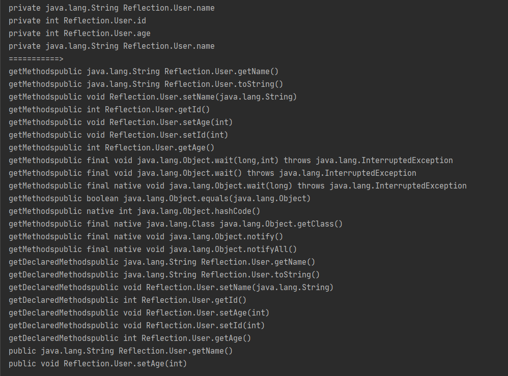

### 8. 通过反射来实例化


```java
public class Test07 {

    public static void main(String[] args) throws ClassNotFoundException, IllegalAccessException, InstantiationException, NoSuchMethodException, InvocationTargetException, NoSuchFieldException {

        Class c1 = Class.forName("Reflection.User");
        //默认调用的是无参构造器，如果没有无参构造就会报错
        //User user = (User) c1.newInstance();//jdk已经直接不推荐使用这种方式
        //System.out.println(user);


        //通过有参构造器
        //Constructor constructor = c1.getDeclaredConstructor(String.class, int.class, int.class);
        //User user2 = (User) constructor.newInstance("zhangsan",18,11);
        //System.out.println(user2);

        //通过反射使用方法
        User user3 = (User) c1.newInstance();
        Method setName = c1.getDeclaredMethod("setName", String.class);
        setName.invoke(user3,"lisi");
        System.out.println(user3.getName());

        //通过反射使用属性
        User user4 = (User) c1.newInstance();
        Field name = c1.getDeclaredField("name");


        //这里因为name在user类中是private的，需要关闭安全检查
        name.setAccessible(true);
        name.set(user4,"mmmmm");
        System.out.println(user4.getName());

    }

}
```


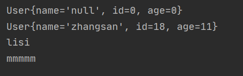

### 9. 获取泛型信息


```java
import java.lang.reflect.Method;
import java.lang.reflect.ParameterizedType;
import java.lang.reflect.Type;
import java.util.List;
import java.util.Map;

public class Test09 {

    public void test01(Map<String, User> map, List<String> list) {
        System.out.println("test01");
    }

    public Map<String, User> test02() {
        System.out.println("test02");
        return null;
    }

    public static void main(String[] args) throws NoSuchMethodException {
        Method method = Test09.class.getMethod("test01", Map.class, List.class);

        Type[] genericParameterTypes = method.getGenericParameterTypes();


        for (Type genericParameterType : genericParameterTypes) {
            //这里只能获得参数的泛型信息，不能获得参数里面的参数的泛型信息
            System.out.println(genericParameterType);
            //把参数泛型取出来
            if (genericParameterType instanceof ParameterizedType) {
                Type[] actualTypeArguments = ((ParameterizedType) genericParameterType).getActualTypeArguments();
                for (Type actualTypeArgument : actualTypeArguments) {
                    System.out.println(actualTypeArgument);
                }
            }
        }

        System.out.println("#############");


        method = Test09.class.getMethod("test02", null);
        Type returnType = method.getGenericReturnType();

        if (returnType instanceof ParameterizedType) {
            Type[] actualTypeArguments = ((ParameterizedType) returnType).getActualTypeArguments();
            for (Type actualTypeArgument : actualTypeArguments) {
                System.out.println(actualTypeArgument);
            }
        }


    }
}
```


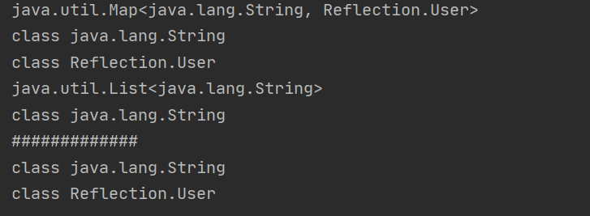

### 10. 获取注解信息

既然是类的一切那就肯定包括注解信息：

```java
import java.lang.annotation.*;
import java.lang.reflect.Field;

//通过反射操作注解
public class Test10 {
    public static void main(String[] args) throws ClassNotFoundException, NoSuchFieldException {
        Class c1 = Class.forName("Reflection.Student02");

        Annotation[] annotations = c1.getAnnotations();
        for (Annotation annotation : annotations) {
            System.out.println(annotation);
        }

        Tablekevin tablekevin = (Tablekevin) c1.getAnnotation(Tablekevin.class);
        String value = tablekevin.value();
        System.out.println(value);

        //获得字段的注解
        Field f = c1.getDeclaredField("name");
        Fieldkevin annotation = f.getAnnotation(Fieldkevin.class);
        System.out.println(annotation.columnName());
        System.out.println(annotation.length());
        System.out.println(annotation.type());

    }

}

@Tablekevin(value = "db_student")
class Student02{

    @Fieldkevin(columnName = "id",type = "int",length = 10)
    private int id;
    @Fieldkevin(columnName = "age",type = "int",length = 10)
    private int age;
    @Fieldkevin(columnName = "name",type = "String",length = 5)
    private String name;

    public Student02() {
    }

    public Student02(int id, int age, String name) {
        this.id = id;
        this.age = age;
        this.name = name;
    }

    public int getId() {
        return id;
    }

    public void setId(int id) {
        this.id = id;
    }

    public int getAge() {
        return age;
    }

    public void setAge(int age) {
        this.age = age;
    }

    public String getName() {
        return name;
    }

    public void setName(String name) {
        this.name = name;
    }

    @Override
    public String toString() {
        return "Student02{" +
                "id=" + id +
                ", age=" + age +
                ", name='" + name + '\'' +
                '}';
    }
}


//类的注解
@Target(ElementType.TYPE)
@Retention(RetentionPolicy.RUNTIME)
@interface Tablekevin{
    String value();
}

//属性的注解
@Target(ElementType.FIELD)
@Retention(RetentionPolicy.RUNTIME)
@interface Fieldkevin{
    String columnName();
    String type();
    int length();
}
```


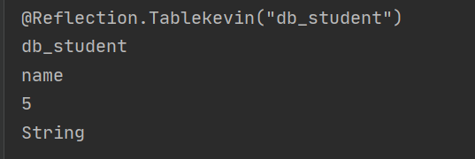